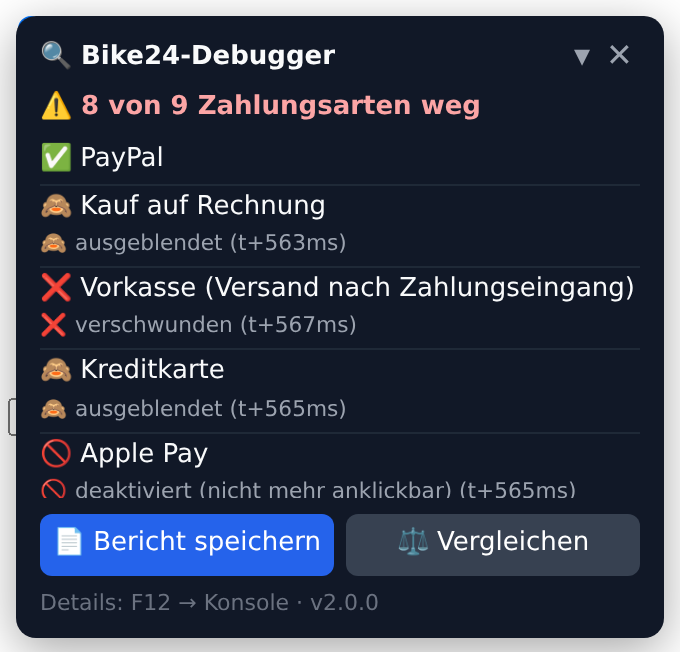

# 🔍 Bike24 Zahlungsarten-Debugger

Liegen **mehrere Artikel** im Warenkorb, verschwinden im Bike24-Checkout nach ca. 0,5 Sekunden einige Zahlungsarten. Mit nur einem Artikel sind alle da. Dieses Skript findet heraus:

- **welche** Zahlungsart verschwindet,
- **wann** (auf die Millisekunde),
- **wie** (CSS, gelöscht oder deaktiviert),
- **durch welchen Code** (Datei und Zeile bei Bike24),
- **nach welcher Server-Antwort**.

Am Ende speicherst du mit einem Klick einen **fertigen Bericht für den Bike24-Support**.

> 🎥 **Stell dir das so vor:** Das Skript baut im Checkout drei Dinge auf:
> - eine **Überwachungskamera** für die Zahlungsarten: *Was* passiert?
> - einen **Fingerabdruck-Scanner** an allen Türen, durch die JavaScript Elemente verstecken kann: *Wer* war's?
> - einen **Mitschnitt der Gespräche** mit dem Server: *Warum*?
>
> Am Ende bekommst du die Videoaufnahme samt Fingerabdruck als Beweismappe.



*So sieht das Panel aus (Beispiel von einer Testseite). Es erscheint unten links auf der Zahlungsseite.*

---

## ⚡ Weg A (empfohlen): Tampermonkey – einmal einrichten, läuft dann automatisch

Tampermonkey ist eine Browser-Erweiterung, die kleine Skripte automatisch auf bestimmten Webseiten startet. Der große Vorteil: Das Skript läuft **schon bevor** die Bike24-Seite geladen ist und erwischt deshalb garantiert den Moment, in dem die Zahlungsarten verschwinden.

### Schritt 1: Tampermonkey installieren
| Browser | Link |
|---|---|
| Chrome / Brave | [Chrome Web Store → Tampermonkey](https://chromewebstore.google.com/detail/tampermonkey/dhdgffkkebhmkfjojejmpbldmpobfkfo) |
| Edge | [Edge Add-ons → Tampermonkey](https://microsoftedge.microsoft.com/addons/detail/tampermonkey/iikmkjmpaadaobahmlepeloendndfphd) |
| Firefox | [Firefox Add-ons → Tampermonkey](https://addons.mozilla.org/de/firefox/addon/tampermonkey/) |

Klick auf **„Hinzufügen“** bzw. **„Installieren“**.

### Schritt 2: Skripte erlauben (nur Chrome, Edge, Brave)
Chrome erlaubt Erweiterungen wie Tampermonkey seit 2025 erst nach einer extra Freigabe:
1. Oben rechts auf das **Puzzle-Symbol 🧩** klicken. Dann bei Tampermonkey auf **⋮** → **„Erweiterung verwalten“**.
2. Den Schalter **„Nutzerskripts zulassen“** (englisch: *Allow User Scripts*) **einschalten**.
   - Gibt es den Schalter nicht (ältere Browser-Version), schalte stattdessen oben rechts den **„Entwicklermodus“** ein.

*Firefox braucht diesen Schritt nicht.*

### Schritt 3: Skript installieren (1 Klick)
👉 **[Hier klicken: bike24-payment-debugger.user.js installieren](https://raw.githubusercontent.com/MarkusP97/Bike24/HEAD/bike24-payment-debugger.user.js)**

Tampermonkey öffnet eine Seite mit dem Code. Dort auf **„Installieren“** klicken. Fertig ✅

> Falls stattdessen nur Text angezeigt wird: Tampermonkey-Symbol → **„Neues Skript erstellen“**. Dort alles markieren und löschen, dann den ganzen Text von [dieser Datei](bike24-payment-debugger.user.js) einfügen (auf GitHub oben rechts „Copy raw file“ ⧉) und mit **Strg + S** speichern.

### Schritt 4: Testen
1. **1 Artikel** in den Warenkorb legen → zur Kasse → bis zur **Zahlungsart-Seite**. Unten links erscheint das Panel und zeigt ✅ bei allen Zahlungsarten.
2. **Mehrere Artikel** in den Warenkorb legen → wieder bis zur **Zahlungsart-Seite**. Das Panel zeigt jetzt 🙈 / ❌ / 🚫 bei den Zahlungsarten, die verschwinden.
3. Im Panel auf **„⚖️ Vergleichen“** klicken. Es zeigt dir schwarz auf weiß, was mit 1 Artikel da war und mit mehreren fehlt.
4. Auf **„📄 Bericht speichern“** klicken. Die Datei landet in deinem **Download-Ordner**.

### Schritt 5: Aufräumen 🔒
Wenn du fertig bist: Tampermonkey-Symbol → beim Skript den **Schalter ausschalten** (oder löschen). Ein Skript, das du gerade nicht brauchst, sollte nicht mitlaufen.

---

## 🧰 Weg B: Ohne Installation, direkt in der Konsole

Gut für einen schnellen Blick. Der Nachteil: Wenn die Zahlungsarten schon weg sind, bevor du einfügst, siehst du zwar **welche** und **wie**, aber nicht den **Code**. Dafür gibt's unten den Profi-Trick.

1. Bike24-Zahlungsseite öffnen und **F12** drücken (Mac: `Cmd + Option + J`). Dann den Tab **„Console“ / „Konsole“** wählen.
2. **Beim ersten Mal** blockiert der Browser das Einfügen, als Schutz vor Betrügern. Dann **`allow pasting`** eintippen und Enter drücken (Firefox: `Einfügen erlauben` bzw. `allow pasting`).
3. [Diese Datei öffnen](bike24-payment-debugger.js) → oben rechts auf **„Copy raw file“ ⧉** klicken → in die Konsole einfügen (**Strg + V**) → **Enter**.
4. Die Seite **nicht neu laden**, sonst ist das Skript weg.

<details>
<summary><b>🎯 Profi-Trick: Skript VOR dem Laden starten (nur Chrome/Edge/Brave)</b></summary>

1. F12 → Tab **„Sources“ / „Quellen“** → rechte Spalte **„Event Listener Breakpoints“** aufklappen → **„Script“** → Haken bei **„Script First Statement“**.
2. Seite neu laden (F5). Der Browser hält beim ersten Skript an (blauer Balken „Paused in debugger“).
3. Zum Tab **Console** wechseln, das Skript einfügen und Enter drücken.
4. Zurück in **Sources**: den Haken wieder **entfernen** und dann **F8** drücken (oder ▶ klicken), damit die Seite weiterläuft.
</details>

---

## 👀 Was die Symbole bedeuten

| Symbol | Bedeutung |
|---|---|
| ✅ | Zahlungsart ist sichtbar und anklickbar |
| 🙈 | **ausgeblendet** (per CSS unsichtbar gemacht, aber noch im HTML) |
| ❌ | **entfernt** (komplett aus der Seite gelöscht) |
| 🚫 | **deaktiviert** (sichtbar, aber nicht anklickbar) |
| 👻 | neu aufgetaucht, aber unsichtbar |
| 👀 / ↩️ | wieder sichtbar bzw. wieder da |

In der Konsole (F12) bekommt jede rote Meldung aufklappbare Details. Beispiel:

```
▼ [B24] 🙈 14:02:10.640 (t+552ms) „Kauf auf Rechnung“ AUSGEBLENDET → display:none auf <li.is-hidden>
        via CSS-Regel „.is-hidden { display: none; }“ aus checkout.css
    📍 Element (anklicken = in der Seite zeigen): <li class="is-hidden">…</li>
    📝 Änderung: <li.is-hidden> Attribut [class]: nicht gesetzt → "is-hidden"
    🧑‍💻 Ausgelöst von Bike24-Code: checkout.4f2a.js Zeile 1, Spalte 88213 → add("is-hidden")
    🌐 Server-Antwort 41ms vorher: POST /api/checkout/payment-methods → Status 200
       Auszug: {"paymentMethods":[{"code":"invoice","available":false,"reason":"MAX_AMOUNT"}…
    🛒 Warenkorb/Kontext: {summe: '412,97 €', artikel: '3', land: 'Deutschland', …}
    💡 Vermutung (nicht bewiesen): Betragsgrenze oder Bonitäts-/Risiko-Prüfung …
```

- **t+552ms** = 552 Millisekunden nach dem Aufruf der Seite.
- Unter „Ausgelöst von“ steht `Error: [B24] kein echter Fehler …`. Das ist **kein Fehler**, sondern nur die Art, wie der Browser den Weg zum Code anzeigt. Die blauen Links darin kannst du anklicken.
- 💡 Die **Vermutung** ist eine Hypothese. Beweise sind nur Änderung, Code-Stelle und Server-Antwort.

---

## 📨 Bericht an Bike24 schicken

1. **„📄 Bericht speichern“** im Panel klicken (oder in der Konsole `b24PayDbg.report()` eintippen).
2. Die Textdatei `bike24-zahlungsarten-bericht-….txt` aus dem Download-Ordner öffnen.
3. Der **obere Teil** ist eine **fertige E-Mail**: kopieren, an den Bike24-Kundenservice schicken und die Datei anhängen.
4. Der **untere Teil** („Technischer Anhang“) ist für die Entwickler bei Bike24.

🔒 **E-Mail-Adressen, Telefonnummern, IBANs, Namen und Adressfelder werden automatisch geschwärzt.** Kurz drüberlesen schadet trotzdem nie.

---

## 🆘 Probleme & Lösungen

<details><summary><b>Das Panel erscheint nicht</b></summary>

- Bist du auf der Seite, auf der man die **Zahlungsart auswählt**? Auf anderen Seiten bleibt das Skript bewusst unsichtbar.
- Tampermonkey: Ist beim Symbol eine rote **1** zu sehen? Wenn nicht: Schritt 2 (Skripte erlauben) prüfen und die Seite neu laden.
- F12 → Konsole → `b24PayDbg.status()` eintippen. Kommt *„b24PayDbg is not defined“*, läuft das Skript nicht.
</details>

<details><summary><b>„Noch keine Zahlungsarten gefunden“</b></summary>

Bike24 hat wohl ein ungewöhnliches HTML. So hilfst du dem Skript:
1. **Rechtsklick** auf eine Zahlungsart → **„Untersuchen“**. Der Entwickler-Bereich öffnet sich und markiert das HTML.
2. Dort nach `name="…"` (bei `<input type="radio">`) oder nach einer `class="…"` suchen, die nach Zahlung klingt.
3. In der Konsole eintippen, z. B.: `b24PayDbg.find('input[name="paymentMethod"]')` oder `b24PayDbg.find('.payment-option')`
</details>

<details><summary><b>„Kein auslösender Code erfasst“ → Code-Stelle manuell finden</b></summary>

Passiert, wenn das Skript zu spät gestartet wurde (Weg B) oder das Ausblenden über einen Weg kommt, den kein Skript abfangen kann (z. B. `element.dataset`). Mit Chrome findest du die Stelle trotzdem:
1. **Rechtsklick** auf die Zahlungsart, die verschwindet → **„Untersuchen“**.
2. Im Elements-Bereich auf das markierte Element (oder dessen Eltern-Element, z. B. `<ul>`) **rechtsklicken** → **„Unterbrechen bei“ / „Break on“** → **„Attributänderungen“** *(attribute modifications)* und **„Entfernen von Knoten“** *(node removal)*.
3. Seite **neu laden** und wieder bis zur Zahlungsseite. Der Browser hält **genau an der Codezeile** an, die die Zahlungsart versteckt. Davon einen Screenshot machen.
</details>

<details><summary><b>Zahlungsart steckt in einem eingebetteten Fenster (z. B. Klarna- oder PayPal-Widget)</b></summary>

Solche Widgets laufen in einem *iframe* (eine Webseite in der Webseite) einer fremden Domain. In der Konsole oben links das Auswahlfeld **„top ▾“** auf das Widget umstellen und das Skript dort per Weg B einfügen.
</details>

<details><summary><b>Ist das sicher? Was macht das Skript genau?</b></summary>

- Es **sendet nichts** ins Internet. Alles bleibt in deinem Browser, der Bericht ist eine lokale Datei.
- Es **liest nur** Zahlungsarten, Seitenänderungen und die Server-Antworten der Bike24-Seite selbst mit und speichert ein paar Zeilen für den Vergleich im Browser (localStorage).
- Es **verändert die Seite nicht**. Ausnahme ist das kleine Panel, das in einem abgeschotteten Bereich (Shadow DOM) liegt. `b24PayDbg.stop()` stellt alles wieder her.
- Der Code ist offen und kommentiert. Faustregel: **Füge nie Code in die Konsole ein, den du nicht nachvollziehen kannst.** Genau davor warnt dich der Browser mit „allow pasting“.
</details>

---

## ⌨️ Alle Befehle (Konsole)

| Befehl | Was er macht |
|---|---|
| `b24PayDbg.hilfe()` | alle Befehle auf Deutsch |
| `b24PayDbg.status()` | Tabelle: welche Zahlungsart ist da, weg und warum |
| `b24PayDbg.report()` | Bericht herunterladen |
| `b24PayDbg.compare()` | 1-Artikel-Lauf vs. Mehr-Artikel-Lauf |
| `b24PayDbg.panel()` | Panel wieder einblenden |
| `b24PayDbg.find('…')` | eigenen CSS-Selektor setzen |
| `b24PayDbg.reset()` | gespeicherte Läufe für den Vergleich löschen |
| `b24PayDbg.stop()` | Debugger beenden, alles wieder im Originalzustand |

---

## 🧪 Für Entwickler

| Datei | Zweck |
|---|---|
| `bike24-payment-debugger.js` | Hauptskript (für die Konsole), hier wird entwickelt |
| `bike24-payment-debugger.user.js` | Tampermonkey-Version, **automatisch erzeugt** mit `node tools/build-userscript.mjs` |
| `tests/` | 22 Testszenarien mit 128 Prüfungen in echtem Chromium (Playwright) |

```bash
cd tests && npm install && npm test   # braucht Playwright + Chromium (npx playwright install chromium)
```

**Getestet (Chromium, alle Tests grün, mehrfach wiederholt):**
- Alle Ausblend-Wege mit korrekter Methode **und** Code-Stelle: `classList`, `style.display`, `style.setProperty`, `setAttribute('style')`, `hidden`, `disabled`, `remove()`, `innerHTML`, `replaceChildren`, `insertRule` (CSS ohne DOM-Änderung), neue `<style>`-Tags, nur die Beschriftung versteckt
- Echte Frameworks: **React 18**, **Vue 3** (`v-if`/`v-show`) und **jQuery 3** (`addClass`/`hide`/`remove`). Die Seiten funktionieren mit dem Debugger weiter.
- Server-Antworten per `fetch` und `XMLHttpRequest`. Schwärzung persönlicher Daten im Bericht.
- Nachgeladene Zahlungsarten, kompletter Neuaufbau der Liste, Seitenwechsel ohne Fehlalarm
- Keine Fehlalarme durch Rechnungsadresse, Versandart „Nachnahme“, Footer-Logos oder die Schrittanzeige „Zahlungsart“
- Strenge Content-Security-Policy und Trusted Types
- Doppelstart, `find()`, `stop()` stellt alle Originalfunktionen wieder her
- Performance: 120.000 DOM-Operationen ca. 130 ms ohne und ca. 185 ms mit Debugger

**Ehrlich gesagt, nicht getestet:**
- **Firefox** wurde nicht automatisiert getestet (im Test-Container nicht verfügbar). Das Skript nutzt nur Standard-APIs mit Fallbacks.
- Gegen die **echte Bike24-Seite** konnte nicht getestet werden, weil der Test-Container keinen Zugriff hat. Falls Bike24 ungewöhnliches HTML nutzt, hilft `b24PayDbg.find()`.
